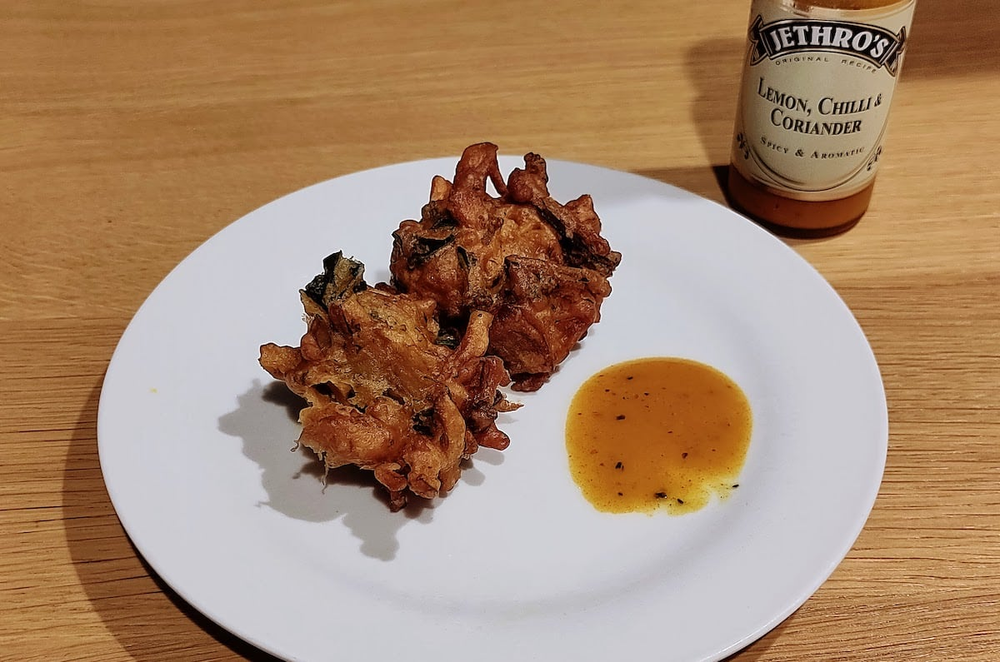
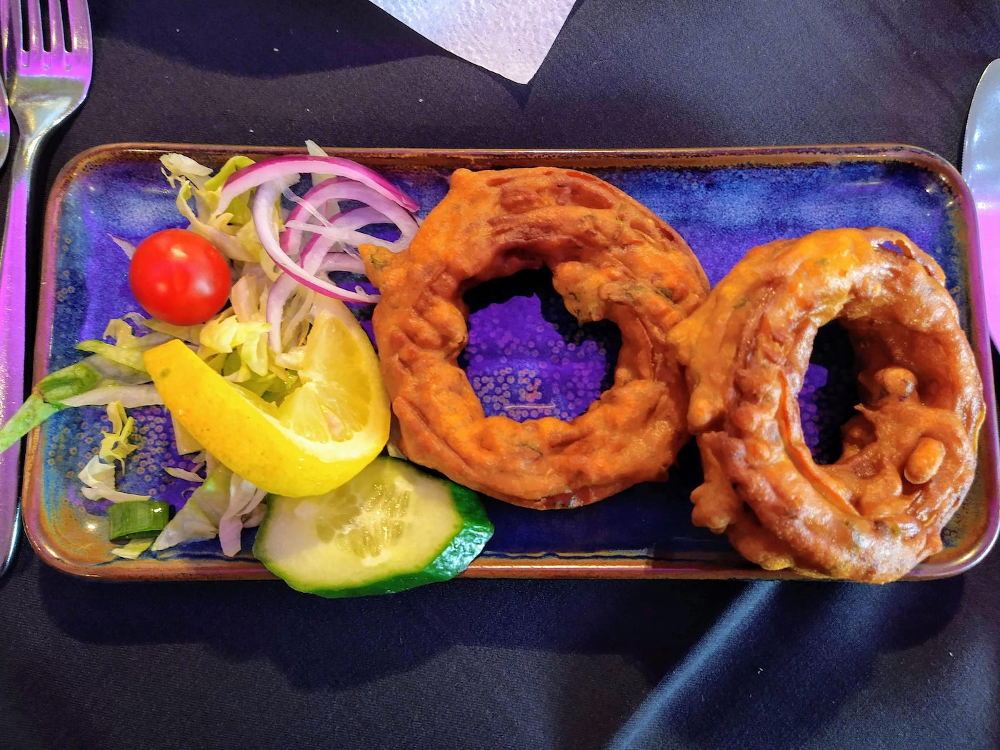

I freaking love onion bhaji. So I tried all the onion bhajis that I could get my hands on locally and here are my ratings. I'll add to this as and when I try more bhajis so check back later for more ratingz. Support local restaurants!!

## Manjit's Kitchen (Leeds) - 10/10

<picture>
    <source type="image/webp" srcset="manjits-bhaji.webp">
    
</picture>

_Thanks Uber Eats for the pic until I get my own._

Truly one of the best bhajis I've tried, if not the most conventional. You get an absolute MOUNTAIN of bhaji bits, rather than individual pieces, for about £5 and they're an awesome accompaniment to a good curry. The flavour is excellent and portion size couldn't be better. Strongly recommend.

## Grove Cafe (Leeds) - 9/10

Really nice chunky bhajis with some interesting spices. Not sure what they put in there --- it's a bit more fast-foody than authentic Indian but really goes down a treat. They also have mushroom bhajis in the same batter that are also amazing. Size and crispiness can sometimes vary but so worth it.

## Bundobust (Leeds) - 7/10

Really nice herbs in these ones. Very crispy, street food style (in keeping with the rest of the menu). Nice little portion. Quite similar to the Cat's PJs ones but a little less salty. So glad to have these in walking distance from my place!

## Cat's Pyjamas (Leeds) - 7/10

A tasty portion here, nice herbs, very street foody again. Can sometimes be a little heavy on the salt but I can't complain too much. Out of these or Bundobust I would probably go for the Bundo ones but definitely enjoy these with the Railway Potato curry --- great pairing.

## Mama Mia (Leicester) - 7/10

<picture>
    <source type="image/webp" srcset="mama-mia-bhaji.webp">
    
</picture>

Got these from the Great Yorkshire Vegan Festival. Big box for £5 I think. Very enjoyable, I think on par with Cat's PJs and Bundo. Had them with some Jethro's sauce which really upgraded the flavour. For some reason I really like the ones with the green leaves in --- not sure what those are though? There were a few more to try at the fest but I only came back with these since I didn't want to have an excess of bhajis 😂

## Aagrah (Leeds) - 6/10

<picture>
    <source type="image/webp" srcset="aagrah-bhaji.webp">
    
</picture>

I went to Aagrah for the first time recently. These ones were interesting, more of a chunky onion ring. They were quite nice and light as a starter, the inside was fluffy and crisp. A little lacking in flavour for me --- luckily we had some dipping sauces. Not the best but good to try.

## Bradford Curry House (Leeds) - 5/10

These ones are quite simple but a little lacking in depth of flavour. Also I'm not keen on the flat ones for absolutely no good reason. That being said, their curries are really good and cheap and these make a nice little accompaniment.

----

If you have any recommendations for me in the UK (mainly Leeds) then please [let me know!](https://twitter.com/intent/tweet?text=@joejoinerr%20You%20should%20try%20the%20onion%20bhaji%20at)
